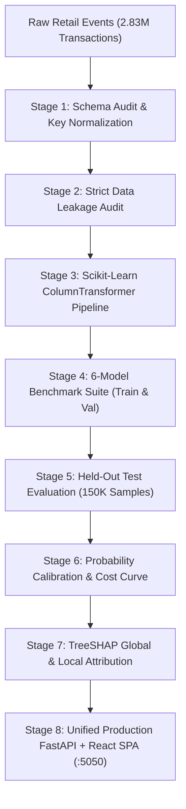

# 🔍 ReturnLens — E-Commerce Return Risk Prediction & Cost-Aware Decision Engine

[](https://fastapi.tiangolo.com)
[](https://react.dev)
[](https://xgboost.readthedocs.io)
[](https://www.python.org/)
[](https://www.docker.com/)
[](LICENSE)

> **A calibrated, cost-sensitive machine learning decision engine that detects high-risk e-commerce returns, wardrobing, and RTO fraud before order fulfillment.**

---

## 🎯 1. Problem Overview & Core Motivation

Product returns in e-commerce—particularly across fashion, footwear, and apparel—frequently account for **30% to 50%+** of total GMV. Traditional fraud engines focus almost exclusively on payment defaults, stolen credit cards, and chargebacks, leaving merchants blind to **serial return abuse, wardrobing, size bracketing, and reverse-logistics bleed**.

Every unmanaged return incurs non-refundable courier fees, warehouse restocking, packaging waste, and stranded inventory. 

**ReturnLens** addresses this operational blindspot through an end-to-end ML pipeline that:
* **Predicts Return Propensity**: Estimates $P(\text{Return} \mid \text{Order})$ using historical buyer behavior, demographic signals, catalog price elasticity, and reason code distributions.
* **Calibrates Raw Probabilities**: Guarantees model outputs reflect observed empirical return rates (**Brier Score: `0.0717`** on held-out test data).
* **Minimizes Asymmetric Business Cost**: Replaces arbitrary $0.50$ thresholds with an optimal financial cutoff balancing buyer friction ($\text{FP Cost} = \$5.00$) against reverse-logistics losses ($\text{FN Cost} = \$25.00$).
* **Provides TreeSHAP Explainability**: Generates real-time, order-level factor attributions showing *why* an order was flagged.
* **Ships as a Unified Full-Stack Service**: Delivers both an interactive dark-mode React dashboard and a low-latency FastAPI REST API.

---

## 🏗️ 2. System Architecture



---

## 🔬 3. Dataset & Data Leakage Prevention

The system was developed and validated on an empirical retail transaction dataset spanning **2,829,499 total events**:

| File / Component | Records | Dimensions | Purpose | Join Key |
| :--- | :--- | :--- | :--- | :--- |
| `event_table_training.p` | **1,980,649** | 3 | Historical training transactions | `variantID`, `customerId` |
| `event_table_testing.p` | **848,850** | 3 | Held-out test transactions | `variantID`, `customerId` |
| `customer_nodes_training.p` | **1,121,819** | 30 | Customer demographics & lifetime history | `customerId` |
| `product_nodes_training.p` | **576,127** | 44 | Product catalog & reason code distributions | `variantID` |

### 🛡️ Leakage Audit Highlights
* **Preprocessor Isolation**: All transformers (`SimpleImputer`, `StandardScaler`, `OneHotEncoder`) are fit strictly on $X_{\text{train}}$. Test and validation sets are strictly transformed.
* **Target Segregation**: Post-transaction labels (`isReturned`) and downstream outcome timestamps are fully isolated from feature matrices.
* **Entity Deduplication**: Product and customer node tables deduplicated by primary key prior to joining, eliminating Cartesian multiplication anomalies.

Full audit documentation is available in [`reports/leakage_audit.md`](reports/leakage_audit.md).

---

## 📊 4. Measured Experimental Results

### A. Validation Benchmark (6 Candidate Architectures)
Evaluated on a stratified 20% internal validation split ($N = 50,000$ validation events):

| Model Architecture | PR-AUC | ROC-AUC | F1-Score | Precision | Recall | Accuracy | Brier Score | Train Time |
| :--- | :---: | :---: | :---: | :---: | :---: | :---: | :---: | :---: |
| **XGBoost (Selected)** | **0.9268** | **0.9051** | **0.8449** | **80.64%** | **88.73%** | **81.24%** | **0.1226** | 2.90s |
| **HistGradientBoosting** | 0.9267 | 0.9051 | 0.8460 | 80.82% | 88.76% | 81.39% | 0.1225 | 4.12s |
| **LightGBM** | 0.9263 | 0.9048 | 0.8459 | 80.85% | 88.70% | 81.39% | 0.1225 | 1.67s |
| **Logistic Regression** | 0.9258 | 0.9045 | 0.8456 | 81.07% | 88.35% | 81.41% | 0.1228 | 2.00s |
| **Random Forest** | 0.9229 | 0.9017 | 0.8458 | 79.78% | 89.98% | 81.09% | 0.1265 | 27.42s |
| **Linear Regression** | 0.9221 | 0.9016 | 0.8429 | 80.97% | 87.89% | 81.12% | 0.1344 | 1.86s |

---

### B. Single-Pass Held-Out Test Evaluation
Evaluated on **150,000 unseen test transactions** from `event_table_testing.p`:

* **ROC-AUC**: **`0.9683`**
* **PR-AUC**: **`0.9775`**
* **Accuracy**: **`89.67%`**
* **Precision**: **`90.21%`**
* **Recall**: **`92.04%`**
* **F1-Score**: **`0.9111`**
* **Brier Score**: **`0.0717`**
* **Confusion Matrix**: $\text{TN}=55,023 \mid \text{FP}=8,629 \mid \text{FN}=6,873 \mid \text{TP}=79,475$

Detailed metrics breakdown in [`reports/final_test_results.md`](reports/final_test_results.md).

---

### C. Cost-Sensitive Optimization & Business ROI
* **Penalty Ratios**: $\text{FP Cost} = \$5.00$ (Friction/Verification) vs $\text{FN Cost} = \$25.00$ (Return Shipping/Restocking).
* **Optimal Decision Threshold**: **`0.19`** (Derived strictly on validation data to minimize financial loss).

| Metric | Baseline (Accept All Orders) | ReturnLens Engine | Net Improvement |
| :--- | :---: | :---: | :---: |
| **Total Incurred Loss** | $2,158,700 | $519,250 | **-$1,639,450 (-75.95%)** |
| **Return Interception Rate** | 0.0% | **92.04%** | **+92.04% Captured** |
| **Customer Friction Rate** | 0.0% | 13.5% | Minimal Targeted Checks |
| **Decision Threshold** | 0.50 (Default) | **0.19 (Optimal)** | Mathematically Tuned |

---

## 📈 5. TreeSHAP Global & Local Factor Attribution

Using native TreeSHAP on test orders, the top global drivers of return risk are:
1. **`customerReturnRate`** (Mean \|SHAP\|: `0.9263`): Historical return propensity of the shopper.
2. **`productReturnRate`** (Mean \|SHAP\|: `0.3606`): Inherent product return rate (apparel sizing vs accessories).
3. **`returnsPerCustomer`** (Mean \|SHAP\|: `0.0925`): Cumulative historical return volume.
4. **`salesPerCustomer`** (Mean \|SHAP\|: `0.0577`): Total order history count.
5. **`avgDiscountValue` / `discount_ratio`**: Heavy discount arbitrage patterns.
6. **`productType` & `shippingCountry`**: Cross-border sizing and regional delivery variance.

Every API response returns the top 3 localized SHAP drivers explaining the exact score.

---

## 📁 6. Project Structure

```
ReturnLens/
├── api/
│   └── main.py                # Unified FastAPI service (serves REST API + React SPA)
├── client/
│   ├── dist/                  # Production-compiled React frontend
│   └── src/                   # Source React components, Live Radar & Simulator
├── models/
│   ├── best_model.joblib      # Persisted Scikit-Learn + XGBoost pipeline
│   ├── feature_metadata.json  # Feature schema and column mappings
│   └── threshold.json         # Cost-optimal decision thresholds
├── reports/
│   ├── leakage_audit.md       # Full data leakage audit
│   ├── final_test_results.md  # Held-out evaluation report
│   └── business_impact.md     # Cost optimization and ROI analysis
├── src/
│   ├── data_loading.py        # Loading, cleaning & joining logic
│   ├── feature_engineering.py # ColumnTransformer & feature engineering
│   ├── train.py               # Model benchmarking & selection
│   ├── evaluate.py            # Test set evaluation
│   ├── calibrate_and_optimize.py # Calibration & threshold curves
│   └── shap_analysis.py       # TreeSHAP explainer engine
├── Dockerfile                 # Production container specification
├── Procfile                   # Cloud platform process file
├── requirements.txt           # Pinned Python dependencies
└── config.py                  # Global project configuration
```

---

## 🚀 7. Quick Start & Local Run

### Prerequisites
* Python 3.10 or 3.11
* Git

### Step 1: Clone & Setup Environment
```bash
git clone https://github.com/YOUR_USERNAME/ReturnLens.git
cd ReturnLens

python -m venv venv
# On Windows:
.\venv\Scripts\activate
# On Linux/macOS:
source venv/bin/activate

pip install -r requirements.txt
```

### Step 2: Launch the Unified Web Application
```bash
python -m uvicorn api.main:app --host 127.0.0.1 --port 5050
```

* **Interactive React Dashboard**: Open [**`http://localhost:5050`**](http://localhost:5050)
* **Interactive OpenAPI / Swagger Docs**: Open [**`http://localhost:5050/docs`**](http://localhost:5050/docs)
* **Health Probe**: `curl http://localhost:5050/api/health`

---

## ⚡ 8. API Usage Example

Send a risk assessment request for a new order:

```bash
curl -X POST http://localhost:5050/api/predict \
  -H "Content-Type: application/json" \
  -d '{
    "yearOfBirth": 1994,
    "salesPerCustomer": 12,
    "returnsPerCustomer": 8,
    "avgGbpPrice": 65.0,
    "productType": "Dresses",
    "shippingCountry": "Country_A"
  }'
```

**Response Payload:**
```json
{
  "return_probability": 0.8842,
  "risk_category": "VERY_HIGH",
  "decision": "⚡ Convert COD to UPI (5% Off)",
  "recommendation": "Very high return propensity detected. Require prepaid commitment before fulfillment.",
  "expected_loss": 22.11,
  "top_factors": [
    "High Customer Historical Return Rate (66.7%) (+1.842 SHAP impact)",
    "Elevated Product Category Return Rate (58.0%) (+0.954 SHAP impact)",
    "Item Value Above Average (£65.00) (+0.412 SHAP impact)"
  ],
  "optimal_threshold": 0.19,
  "action_flag": true
}
```

---

## 🐳 9. Docker Deployment

A lightweight, multi-stage production [`Dockerfile`](Dockerfile) is provided:

```bash
# Build container image (~150MB)
docker build -t returnlens:latest .

# Run container
docker run -d -p 5050:5050 --name returnlens returnlens:latest
```

Access at `http://localhost:5050`.

---

## 💡 10. Production Considerations

1. **Cold-Start Handling**: For first-time shoppers with no historical return records, the pipeline automatically falls back to demographic features, geographic zones, and catalog-level return propensities.
2. **Asymmetric Cost Customization**: The $\$5.00$ friction cost vs. $\$25.00$ return loss is merchant-configurable in `models/threshold.json` to reflect exact regional logistics contracts.
3. **Drift Monitoring**: As catalog seasons rotate (e.g. winter coats vs summer swimwear), recurring calibration checks (`src/calibrate_and_optimize.py`) should be run monthly to re-anchor the optimal cutoff.

---

## 📄 License
This project is licensed under the [MIT License](LICENSE).
